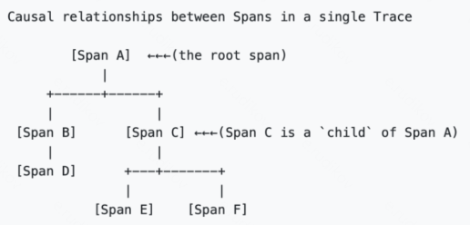
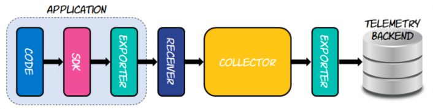
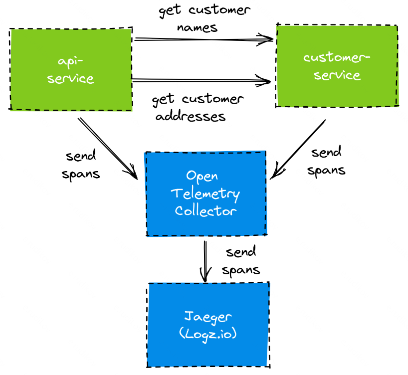

# Spring Boot OpenTelemetry example

  

Пример использования трейсинга [OpenTelemetry](https://opentelemetry.io/docs/concepts/signals/traces/) в Spring Boot приложении.

Реализации для Spring Boot 2 и Spring Boot 3 **_различаются_** и находятся в соответствующих ветках.

## Описание

OpenTelemetry - это целый набор практик и инструментов, определяющих, какие сигналы может генерировать приложение для взаимодействия с внешним миром, а также как эти сигналы можно собирать и визуализировать для наблюдения за состоянием приложений и системы в целом. Три основных типа сигналов: трассировка, логирование и сбор метрик.

### Контексты
OpenTelemetry вводит понятие контекста операции. Контекст в первую очередь включает в себя атрибуты trace_id (идентификатор текущей операции) и span_id (идентификатор подзапроса, при ретраях каждый подзапрос, например, должен иметь уникальный span_id). Кроме того, контекст может содержать статическую информацию, такую как название ноды, на которой развернуто приложение, или название окружения (prod/qa). Такие поля в терминологии OpenTelemetry называются resource и прикрепляются к каждому логу, метрике или трассировке для более удобного поиска. Дополнительно в контексте могут содержаться динамические данные, например, идентификатор текущего эндпоинта ("http_path": "GET /user/:id/info"), которые могут быть выборочно прикреплены к группе логов, метрик или трассировок. [**_W3C Trace Context_**](https://www.w3.org/TR/trace-context/) - объединяет в себе практики различных подходов и является стандартным в OpenTelemetry.

  

### Sampling
В высоконагруженных системах трафик выгружаемых логов и трейсов может достигать огромных значений, требуя невероятных расходов на инфраструктуру и хранение данных. Для решения этой проблемы стандарты OpenTelemetry включают в себя возможность семплирования сигналов – возможность выгружать не все трейсы и логи, а только их часть.
Для решения этой проблемы механизмы распространения контекста OpenTelemetry передают флаг семплирования вместе с trace_id/span_id. Это необходимо для того, чтобы, если сервис, первый принявший запрос от пользователя, решит, что запрос должен быть выгружен подробно, все остальные системы также должны следовать этому решению и также выгружать данные подробно. В противном случае все системы должны выгружать сигналы частично или не выгружать вовсе, чтобы сэкономить ресурсы. Такой подход называется "Head Sampling" - решение принимается в начале обработки запроса случайно или на основе каких-то входных атрибутов.
Кроме этого, OpenTelemetry поддерживает режим "Tail Sampling", при котором все приложения всегда выгружают все сигналы подробно, но существует некоторый промежуточный буфер. После получения всех данных этот буфер принимает решение о том, стоит ли сохранить данные полностью или оставить лишь частичную выборку.

### Baggage
Механизм Baggage позволяет вместе с trace_id/span_id передавать произвольный набор пар ключ-значение, который автоматически будет передаваться между всеми микросервисами по ходу обработки запроса. Этот механизм полезен для передачи дополнительной информации, которая необходима на протяжении всего пути запроса – например, для передачи информации о пользователе или настройках среды выполнения.
Пример заголовка для передачи baggage по стандарту w3c - `tracestate: rojo=00f067aa0ba902b7,congo=t61rcWkgMzE,userId=1c30032h5`

### Процесс

Используйте OpenTelemetry SDK, созданный для языка, на котором вы работаете, чтобы внедрить трассировку в ваш код.
OpenTelemetry отправляет собранные данные в любой бэкэнд (Jaeger, Zipkin и т. д.) для дальнейшего анализа и визуализации. Настройка OpenTelemetry для экспорта трасс начинается с написания конфигураций для сбора и экспорта данных в OpenTelemetry Collector

**OpenTelemetry Collector** является частью конвейера сбора данных, который получает телеметрические данные и отправляет их на любой настроенный бэкэнд.

  

  

## Полезные ссылки

- https://habr.com/ru/companies/oleg-bunin/articles/865690/
- https://edgedelta.com/company/blog/what-is-opentelemetry-tracing
- https://reflectoring.io/spring-boot-tracing/
- https://piotrminkowski.com/2023/11/15/kafka-tracing-with-spring-boot-and-open-telemetry/
- https://github.com/ThomasVitale/spring-boot-opentelemetry
- https://github.com/open-telemetry/opentelemetry-java-instrumentation/tree/main/instrumentation
- https://habr.com/ru/companies/flant/articles/892784/
